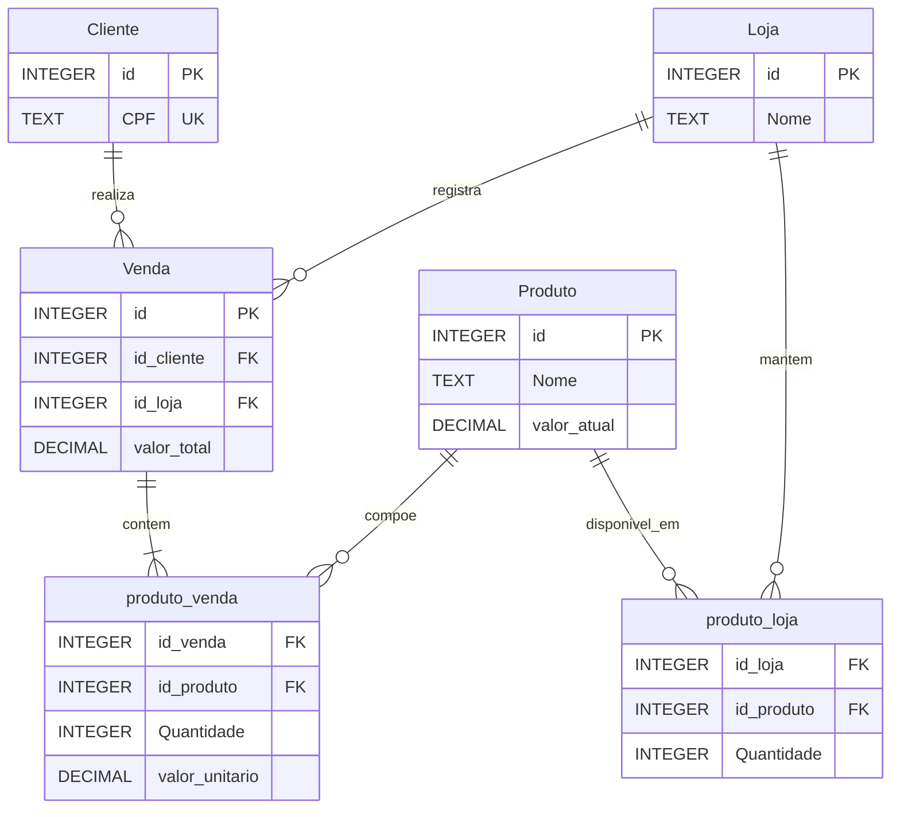

## Modelo de dados

```mermaid
erDiagram
    Cliente ||--o{ Venda : realiza
    Loja ||--o{ Venda : registra
    Venda ||--|{ produto_venda : contem
    Produto ||--o{ produto_venda : compoe
    Loja ||--o{ produto_loja : mantem
    Produto ||--o{ produto_loja : disponivel_em

    Cliente {
        INTEGER id PK
        TEXT CPF UK
    }

    Loja {
        INTEGER id PK
        TEXT Nome
    }

    Venda {
        INTEGER id PK
        INTEGER id_cliente FK
        INTEGER id_loja FK
        DECIMAL valor_total
    }

    Produto {
        INTEGER id PK
        TEXT Nome
        DECIMAL valor_atual
    }

    produto_venda {
        INTEGER id_venda FK
        INTEGER id_produto FK
        INTEGER Quantidade
        DECIMAL valor_unitario
    }

    produto_loja {
        INTEGER id_loja FK
        INTEGER id_produto FK
        INTEGER Quantidade
    }
```